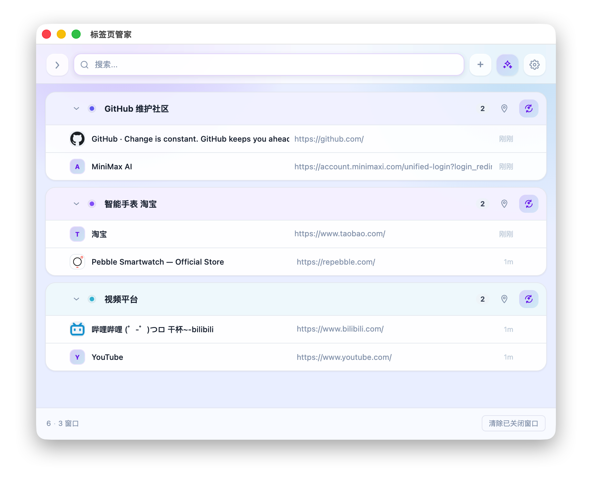
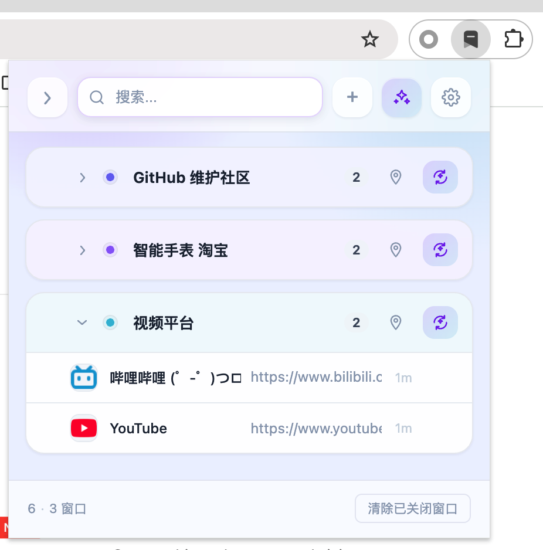
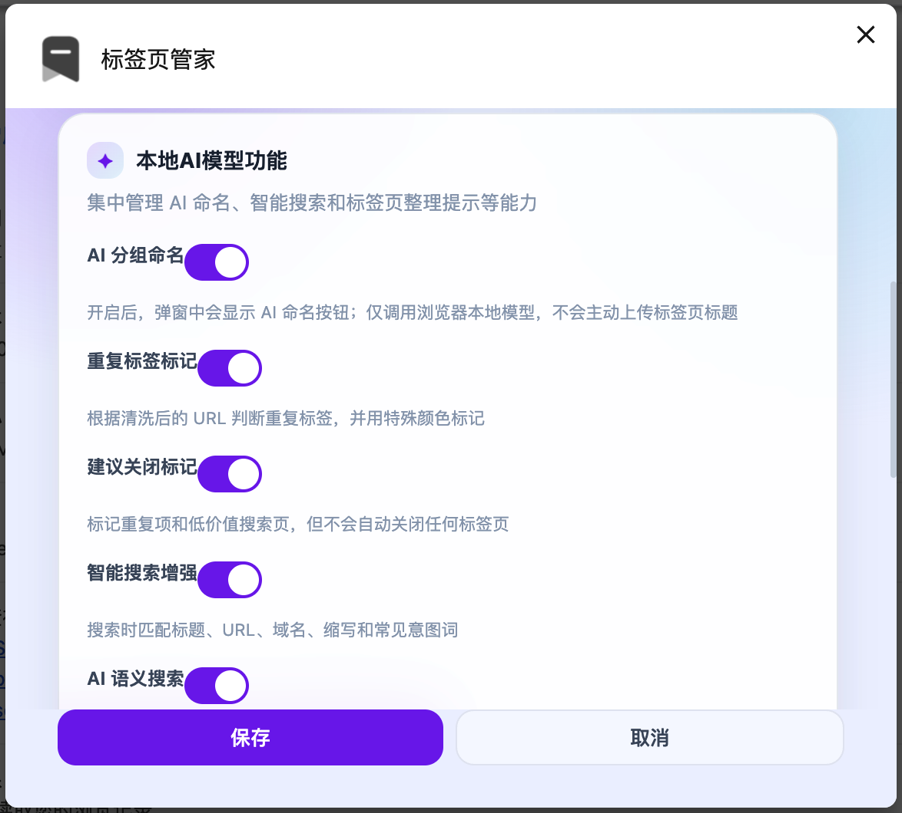

# 标签页管家

[English](README.md) | [中文](README_zh.md)

---

**自动记录、整理、搜索和恢复浏览器标签页，并按窗口分组管理。**

当前版本：`3.0.0`

## 界面预览

### 弹出窗口视图 —— 按窗口分组的标签页历史

### 独立窗口模式 —— 展开的标签页历史

### 本地 AI 模型功能设置

## 功能特点

### 标签页历史记录
- 自动在后台记录所有打开的标签页
- 保存 URL、标题、图标和打开时间
- 按窗口分组，方便管理
- 开启「保留已关闭分组」后，关闭窗口不会自动删除该分组记录

### 快速恢复
- 点击任意标签页可直接跳转到该标签（如果仍打开）
- 点击已关闭窗口中的标签页可重新在新窗口中打开
- "打开全部" 按钮可一键恢复所有已关闭的标签页

### 窗口管理
- 可为窗口分组设置自定义名称
- 支持单独清除已关闭窗口的记录
- 可删除特定标签页记录
- 支持在独立窗口中打开历史记录（可在设置中开启）
- 支持拖拽调整分组顺序
- 支持用颜色圆点区分不同分组
- 当前正在使用的 Chrome 窗口会在列表中高亮显示

### 本地 AI 模型功能
相关能力可在设置中按需开启。浏览器支持时，扩展会调用 Chrome 本地模型，不会主动把标签页标题上传到远端服务。

- AI 分组命名：根据分组内标签页标题和域名生成或重新生成分组名称
- 更智能的命名输入：重复标题会先合并并保留出现次数，再作为权重信息传给模型
- 重复标签标记：根据规范化后的 URL 判断重复标签，并用特殊标记提示
- 建议关闭标记：标记重复项和低价值搜索页，但不会自动关闭任何标签页
- 智能搜索增强：匹配标题、URL、域名、缩写和常见意图词
- AI 语义搜索：先展示普通搜索结果，再异步用本地 AI 模型补充语义相关标签页

### 设置分组
设置页分为三个区域：

- 管理：控制独立窗口打开方式、是否保留已关闭分组
- 本地 AI 模型功能：控制 AI 命名、重复标记、建议关闭、智能搜索和 AI 语义搜索
- URL 过滤：配置包含和排除关键字规则

### URL 过滤
- 使用关键字过滤要保存的标签页
- 在设置中配置包含/排除规则
- 排除优先于包含

### 独立窗口模式
在设置中开启「在独立窗口中打开」后，点击扩展图标会在一个独立的窗口中显示标签页历史列表，窗口大小会根据屏幕尺寸自动调整。

### 多语言支持
- 支持：中文、英语、韩语、日语、德语
- 自动跟随浏览器语言设置

## 使用方法

1. **安装**：在 `chrome://extensions/` 加载扩展（启用开发者模式 → 加载已解压的扩展程序 → 选择本文件夹）

2. **查看历史**：点击扩展图标查看按窗口分组的已记录标签页

3. **恢复标签**：点击任意标签页可跳转到该标签（如果仍打开）或创建新标签（如果已关闭）

4. **启用 AI 功能**：打开设置，按需开启本地 AI 模型相关能力

5. **过滤标签**：打开设置配置 URL 关键字过滤规则

6. **整理管理**：重命名分组、拖拽调整顺序、用颜色区分工作上下文，并在需要时移除记录

## 隐私说明

本扩展程序的标签页记录和设置仅存储在本地 Chrome 浏览器中，不会收集或上传用户数据。

开启本地 AI 功能后，标签页标题和简化后的 URL 信息只会在浏览器本地模型 API 可用时传给 Chrome 本地模型。AI 语义搜索为异步增强能力；本地模型不可用时，会自动保留普通搜索结果。

## 开源协议

MIT License
