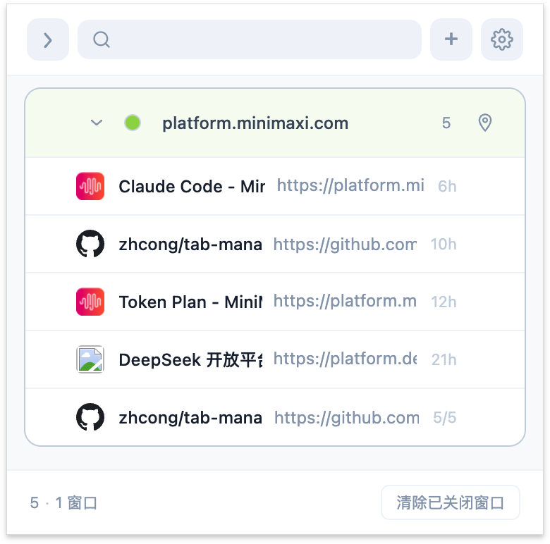
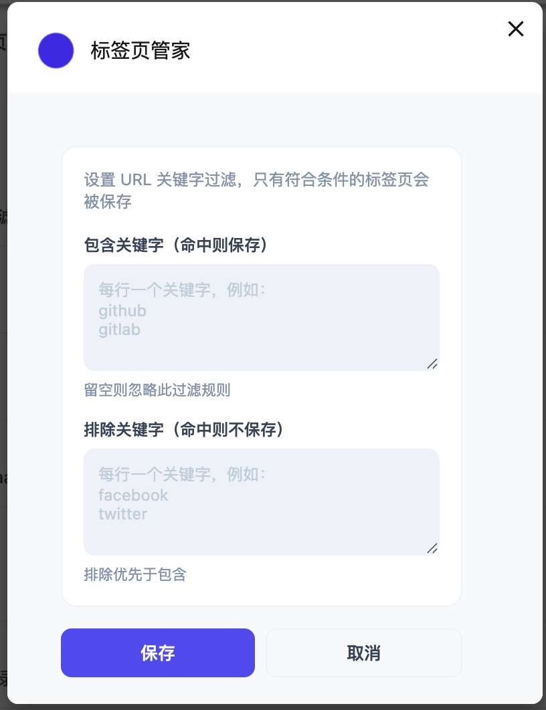

# 标签页管家

[English](README.md) | [中文](README_zh.md)

---

**自动记录浏览器打开的标签页，关闭后可一键重新打开。**

## 功能特点

### 标签页历史记录
- 自动在后台记录所有打开的标签页
- 保存 URL、标题、图标和打开时间
- 按窗口分组，方便管理

### 快速恢复
- 点击任意标签页可直接跳转到该标签（如果仍打开）
- 点击已关闭窗口中的标签页可重新在新窗口中打开
- "打开全部" 按钮可一键恢复所有已关闭的标签页

### URL 过滤
- 使用关键字过滤要保存的标签页
- 在设置中配置包含/排除规则
- 排除优先于包含

### 窗口管理
- 可为窗口分组设置自定义名称
- 支持单独清除已关闭窗口的记录
- 可删除特定标签页记录
- 支持在独立窗口中打开历史记录（可在设置中开启）

### 独立窗口模式
在设置中开启「在独立窗口中打开」后，点击扩展图标会在一个独立的窗口中显示标签页历史列表，窗口大小会根据屏幕尺寸自动调整。

### 多语言支持
- 支持：中文、英语、韩语、日语、德语
- 自动跟随浏览器语言设置

## 使用方法

1. **安装**：在 `chrome://extensions/` 加载扩展（启用开发者模式 → 加载已解压的扩展程序 → 选择本文件夹）

2. **查看历史**：点击扩展图标查看按窗口分组的已记录标签页

3. **恢复标签**：点击任意标签页可跳转到该标签（如果仍打开）或创建新标签（如果已关闭）

4. **过滤标签**：打开设置配置 URL 关键字过滤规则

5. **整理管理**：鼠标悬停在窗口标签上可重命名分组，使用删除按钮移除记录

## 隐私说明

本扩展程序所有数据仅存储在本地 Chrome 浏览器中，不会收集或上传任何用户数据。

## 开源协议

MIT License
